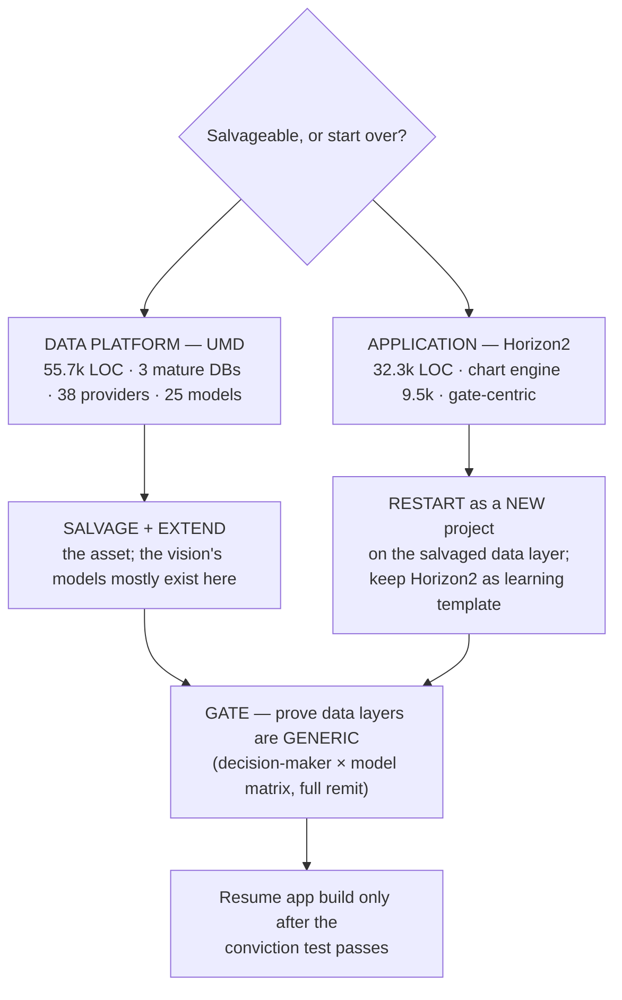

# 00 — Executive Summary & Recommendation

**Prepared for:** Richard Walker (Lucidate Ltd)
**Subject:** Horizon2 / UMD — fitness assessment and the salvage-vs-rewrite decision
**Date:** 2026-07-10
**Status:** Decision document. Read this first; the twelve supporting documents provide the evidence.
Documents 10–12 add the research substance that makes the recommendation
buildable: the universal input-*state* principle (§10, correcting a naïve
"inflation only" reading of derivatives), the literature review of the accepted
models (§11), and the SoTA agentic / prompting / context-engineering review (§12).

---

## The question

> *Is this project salvageable, or are we better off starting a new project and using this one as a learning template of what went horribly wrong?*

It is the right question, and it has a two-part answer, because the project is
two projects wearing one name.

## The recommendation, in one line

> **Salvage the data platform (UMD) in full — it is the asset. Do not patch the
> application (Horizon2); start a new application project on top of the salvaged
> data layer, and keep Horizon2 as the cautionary reference. Verdict: SALVAGE the
> foundation, RESTART the house.**

## Why the answer is split, not binary

The two halves have opposite verdicts, and conflating them is what has kept the
project stuck.

| Layer | What it is | Size | Verdict | Why |
|---|---|---|---|---|
| **Data platform — UMD** | 38 data providers, 25 quantitative models, 3 mature databases | **55,700 LOC**, 4,093 series, 26M rows | **SALVAGE (extend)** | Years of genuine, largely-sound engineering. The models and data the vision needs mostly already exist. The gaps are *additive* (taxonomy, a model catalog), not architectural rot. |
| **Application — Horizon2** | LangGraph article pipeline: chart engine, infographic, writer, gates | **32,300 LOC** (chart engine alone 9,500) | **RESTART (new project)** | Its core architecture — plot raw series, pass gates — is the wrong shape for the vision, its two flagship surfaces (charts, infographic) use the wrong *mechanism*, and its embedded working-culture actively fights the target design. |

The owner's own instinct — *"validate the data layers before any app development"* —
is exactly right, and this assessment confirms it: the foundation is worth
keeping; the structure built on it is not.

## The three findings that drive the verdict

1. **There is no model in the "insights."** The application plots raw series and
   dresses them as charts. The vision — every decision-maker runs a *model* on
   data to reach a *decision* — has no representation anywhere in the running
   system. The graph database, audited live, contains **zero** model /
   decision-maker / specification nodes (§03). You cannot incrementally refactor
   a missing spine into existence inside a codebase built around its absence.

2. **The surfaces use the wrong mechanism, not just the wrong parameters.** Charts
   are rendered from a 5-grammar templating engine that can only ever produce
   "two lines and a wedge / a distribution / a bar" (§04). The infographic is
   rendered by a **diffusion image model** (`gpt-image-2`) and then OCR-checked —
   a mechanism that *cannot* render exact numbers by construction, when the
   correct, published technique (Infogen / LIDA) is verified-numbers →
   deterministic code (§04, §06). These are replace-not-repair.

3. **The failure is cultural and it is encoded in the app.** The project
   repeatedly reported success on *process* ("all gates passed, exported clean")
   while the *product* was broken — including shipping charts with nonsense
   values and a validation panel that literally printed *"All checks passed"* over
   failing content (§04). That culture is baked into Horizon2's gate-centric
   design. A new project is the cleanest way to leave it behind; patching in place
   carries it forward.

Crucially, **none of these three findings implicates UMD.** They are all
application-layer. The data platform is the victim of the app's shortcomings, not
their source.

## What "restart the application" does and does not mean

- It **does not** mean greenfield-everything. UMD — the providers, the 25
  quantitative models in `analysis/`, the databases — is kept and extended.
- It **does** mean a new application repository whose architecture is the
  vision from day one: a **model catalog → model selection → non-LLM execution →
  model-grounded narration → deterministic rendering** pipeline (the
  AI-Economist-Agent pattern, §01, §06), consuming the salvaged data layer.
- It **does** mean cherry-picking Horizon2's few genuinely good,
  architecture-agnostic parts (DOCX/Substack export, the fact-check "numbers must
  trace" discipline, the LangGraph orchestration know-how) as *lift-outs*, not a
  wholesale port (§08).

## The gate before any of that: prove the data layers are generic

Per the owner's directive, **no application work resumes** until the three data
layers are demonstrably fit for a *generic* app across the full Lucidate remit —
not FOMC. The immediate work (§09) is therefore data-layer, not app:

1. Author the **decision-maker × model matrix** (11 personas × models × required
   data), the generic yardstick (§05).
2. Close the three concrete data-layer gaps (§07): normalize the time-series
   **taxonomy**; add a relational **model-config / run** store; seed the graph
   **model spine** (the catalog that is entirely absent today).
3. Pass the **conviction test**: every decision-maker in the matrix traces cleanly
   `decision → model → inputs (present + classified) → execution → outputs →
   relationships` through the three layers. Only then does app work resume.

## Decision at a glance

## Confidence and honesty note

This recommendation is deliberately not the flattering one ("it's salvageable,
keep going"). The evidence — a live audit of all three databases, a component
inventory of 88,000 lines of code, and a documented pattern of process-over-product
failure — points to keeping the expensive, sound part (the data) and restarting
the cheap-by-comparison, mis-architected part (the app). The supporting documents
show the working. If a single fact in §03, §04, §07, or §08 is wrong, the verdict
should be re-examined; nothing here is asserted without a citation to a live
finding.
