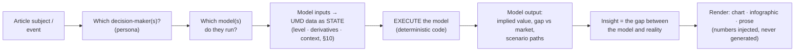

# 01 — The Vision: model → data → insight → decision

## The core idea

Every serious market participant reaches a decision the same way: they run a
**model** on **data** to produce an **insight** that informs a **decision**.

- An **FOMC member** carries a reaction function — a mental or formal model that
  ingests the labour market, manufacturing, trade, the currency, housing,
  inflation, and which parts of the economy are overheating or undershooting —
  and outputs a view on the appropriate policy rate. Critically, *each* of those
  inputs is read as a **state, not a level**: its value, its direction and speed
  (first derivative), its acceleration (second derivative), and its context. This
  is universal, not an inflation quirk — see §10.
- A **global-macro rates trader** runs a different but overlapping model — curve
  fair value, carry and roll-down, term premium, the OIS-implied path — to
  position a swap book *ahead* of that decision.
- A **corporate treasurer** runs another — cost-of-carry, hedging ratios, funding
  versus inflation — to decide how to hedge.

The list is long, but the pattern is identical: **decision-maker → model →
data → insight → decision.** The number at the centre of an article — an FOMC
call, a positioning view — is never "a made-up number." It is the output of a
model, held by a person, fed by many variables.

## What this makes the product

Horizon's differentiator is *not* charts. It is **insight** — and insight is the
**output of running the relevant decision-maker's model against real,
multi-dimensional data, told as that model would tell it.** The chart, the
infographic, and the prose are three *renderings* of that model output. They are
downstream of the model, never a substitute for it.

Lucidate holds the two ingredients this requires:

1. **Vast data** — UMD's 4,093 series across every major asset class (§03).
2. **A near-limitless library of real models** — sourced from public research
   (ArXiv, Fed / BIS / ECB working papers, textbooks) — that map multi-dimensional
   inputs to multi-dimensional outputs.

The job is to combine them: for any subject, identify the decision(s) at stake,
the decision-maker(s), and the model(s) they use; bind those models to the data;
run them; and render the story the model tells.

## This is a known, published architecture

The vision is not speculative. It is the subject of current peer-reviewed work,
which supplies both the blueprint and the guardrails.

### The AI Economist Agent (arXiv 2606.20041)

A framework for *model-grounded* economic analysis, proven on exactly Lucidate's
domain — *US inflation persistence & Federal Reserve policy* and *bank
stress-test narratives*. Its architecture is the target:

- A **knowledge graph** stores a **model catalog** — `Model → ModelSpecification →
  ModelEquation / ModelAssumption / Inputs / Outputs` — *separately* from text
  evidence.
- A **planner** frames the analysis; a **graph retriever** returns *executable
  model context*; a **model-selection agent** emits a *structured request*
  choosing a graph model node (never free text).
- A **non-LLM executor** binds inputs, runs the model's implementation function,
  and writes `ModelRun / ModelOutputPoint` back to the graph.
- A **report generator** narrates *grounded strictly in the computed outputs*.
- A **judge** scores *model grounding* and *numerical discipline*.

Its central, load-bearing finding:

> **The LLM selects and narrates; it never generates the numbers. Model grounding
> requires execution. Naming a model without running it scores zero.**

This single principle is the difference between the vision and what Horizon2 does
today. Horizon2 has no model to name, let alone execute.

### Infogen / Microsoft LIDA — the rendering guardrail

The same principle governs how the numbers reach the page. The published,
data-faithful technique for infographics and charts is:

> **verified numbers → structured metadata → deterministic layout *code*
> (HTML / SVG / Plotly) with the numbers injected as literal text → render.**

Numbers are extracted **once** and **never regenerated**, "preventing drift
between claim and visualization." LIDA reports **< 3.5%** numeric error this way.
The corollary is decisive for the infographic litmus test: a **diffusion image
model cannot render exact numbers** and must not be used for a numeric artifact.

## The unifying principle (applies to charts, infographics, and prose)

> **LLMs select, design, and narrate. Models + data produce the numbers. Code
> renders deterministically. The LLM never authors a number.**

Every quantity must be *traceable*: `decision → persona → model spec → executed
run → output point → rendered mark / prose token`. This is the standard the
current application fails on all three surfaces (§04), and the standard the target
architecture is built to meet (§06).

## What "generic" means here

The vision is worthless if it works for one decision-maker and no others — the
recurring failure of this project. "Generic" means the *same* machinery serves
**every** decision-maker in the Lucidate remit: central bankers, macro and
relative-value rates traders, treasurers, credit / FX / commodity / equity /
volatility / event-market traders, and forecasters (§05). That is why the next
gate is not "build a great FOMC chart" but "prove the data layers can feed *every*
decision-maker's model" (§07, §09).
