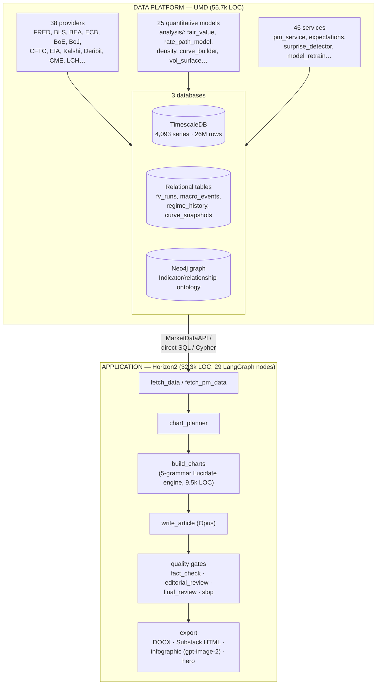

# 02 — Current-State Architecture

This document describes what exists today, accurately and without euphemism, so
the audit (§03) and post-mortem (§04) rest on a shared picture.

## Two systems, one product

## The application pipeline (Horizon2)

Horizon2 is a **LangGraph state machine of 29 nodes** producing one article per
run. The spine, in order:

1. **select_event / resolve_data** — resolve a template or free-text subject to a
   set of UMD series.
2. **fetch_data / fetch_pm_data** — pull those series (direct SQL to TimescaleDB
   and `MarketDataAPI`), plus Kalshi prediction-market data.
3. **chart_planner** — in subject mode, a Sonnet call picks *which* charts: 2–4
   `{chart_type, series, one-line title}` intents from a 4-item vocabulary.
4. **build_charts** — the **Lucidate engine**: for each intent a Sonnet tool-use
   call emits a typed `LucidateChartSpec`, which one of **five deterministic
   grammar builders** (G1 wedge, G2 atlas, G3 lattice, G4 layered, G4 stacked)
   renders via Plotly. ~9,500 LOC — the largest single subsystem.
5. **write_article** — a single multimodal Opus call writes prose around the
   charts (the charts' PNGs are now passed to the model).
6. **quality gates** — `fact_check`, `editorial_review`, `final_review`, house-style
   and slop critics, with a revise-or-refuse loop and an "export-with-warnings"
   policy.
7. **export** — DOCX, Substack HTML, a **hero illustration and an infographic
   (both via the `gpt-image-2` diffusion model)**, and a social card.

### What the pipeline *is*, architecturally

It is a **series-plotting and gate-checking pipeline**. Its organising ideas are
"select some series and a chart shape" and "pass a battery of text-based gates."
There is **no model-execution stage** and **no representation of a decision-maker
or their model** anywhere in the 29 nodes. Insight, in the vision's sense, has no
home in this design.

## The data platform (UMD)

UMD is a mature, multi-database market-data warehouse.

- **Providers (13.4k LOC, 38 files):** one `BaseProvider` subclass per source,
  auto-discovered, each declaring `SeriesSpec`s. Coverage spans official macro
  (FRED, BLS, BEA), every major central bank, IMF/OECD/World Bank, positioning
  (CFTC), commodities (EIA, USDA, FAO), rates curves (CME, LCH), options (Deribit,
  equity options), and prediction markets (Kalshi economics + perps).
- **Analysis (11.6k LOC, 25 files):** *executable quantitative models* —
  `fair_value`, `spx_fair_value`, `rate_path_model`, `rate_divergence`, `density`,
  `kalshi_implied_distribution`, `gaussian_rate_kernel`, `curve_builder`,
  `vol_surface`, `historical_vol`, and more. **These are precisely the
  "implementation functions" the target architecture needs** — they already run
  and produce numbers.
- **Services (18.2k LOC, 46 files):** orchestration, including `pm_service`
  (fair-value pipeline), `expectations` (market-implied surprise baseline),
  `surprise_detector`, and `model_retrain`.
- **Three databases** (detailed in §03):
  - **TimescaleDB** — the time-series store (`observations`, 4,093 series).
  - **Relational tables** (same instance) — model *outputs* and snapshots
    (`fv_runs`, `divergence_signals`, `regime_history`, `curve_snapshots`,
    `spread_snapshots`, `macro_events`, `world_state_snapshots`).
  - **Neo4j** — an economic-relationship graph (`Indicator`, `TRANSMITS_TO`,
    `SENSITIVE_TO`, `CORRELATES_WITH`, …).

### What the data platform *is*, architecturally

A sound, extensible data layer with real models attached — **but wired to serve
the current app, not the vision.** The models in `analysis/` are called ad hoc by
services; they are *not* catalogued, not bound to decision-makers, and their
selection is hard-coded, not reasoned. The graph describes *relationships between
indicators*, not *models held by decision-makers*. The raw material for the vision
is here; the organising spine is not.

## The seam between them

Horizon2 consumes UMD through `MarketDataAPI`, direct SQL, and Cypher — a clean,
well-defined seam. This matters enormously for the recommendation (§08): because
the two systems are decoupled at a real interface, **the data platform can be kept
and extended while the application is rebuilt against the same seam.** The seam is
the reason "salvage the data, restart the app" is a coherent, low-risk option
rather than an all-or-nothing gamble.
