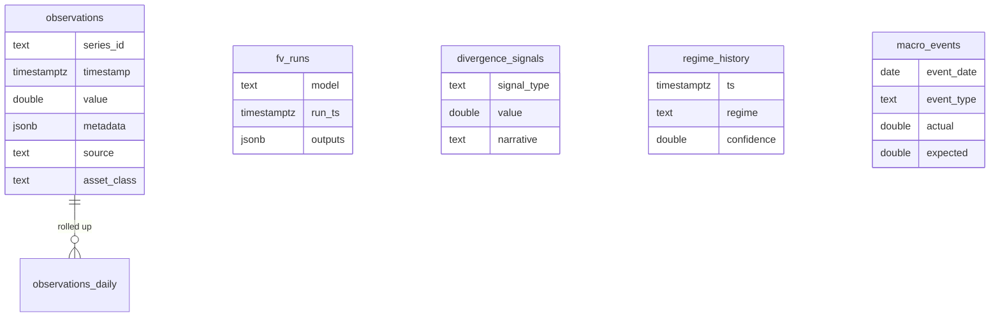
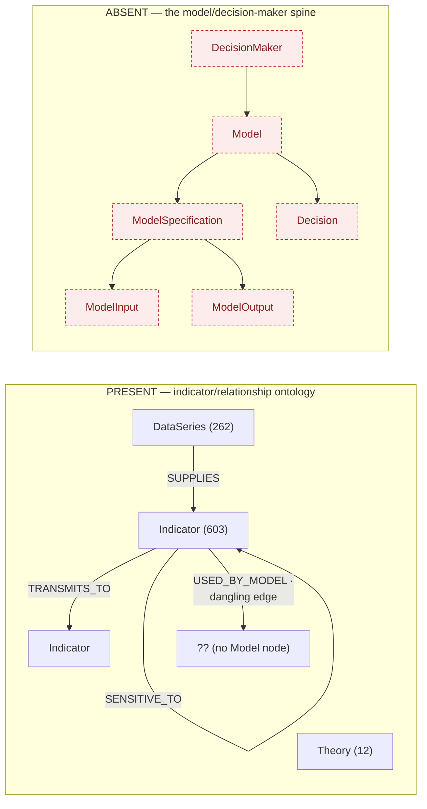

# 03 — Data-Layer Audit (live findings)

All figures below are from **live queries run against the production databases**
on 2026-07-10, not from documentation. This is the evidence base for the
"validate the data layers first" gate.

## Summary verdict

| Layer | Fit for a generic app? | Nature of the gap |
|---|---|---|
| Time-series (TimescaleDB) | **Partially** — broad but un-normalized | Data-quality (inconsistent taxonomy); coverage to be confirmed against the model matrix |
| Relational (same instance) | **Partially** — outputs yes, config no | Stores model *outputs*; has no model *config* store |
| Graph (Neo4j) | **No** — the spine is absent | Rich *indicator* ontology; **zero** model / decision-maker nodes |

## 1. Time-series layer — TimescaleDB

**Scale:** 4,093 distinct series, **26,091,070** observations.

**Breadth by source (top):**

| Source | Series | | Source | Series |
|---|---|---|---|---|
| kalshi | 2,214 | | fred | 105 |
| kalshi_trades | 565 | | yahoo | 92 |
| cme | 346 | | bls | 59 |
| worldbank | 307 | | sovereign_cds | 56 |
| derived | 126 | | oecd/ecb/eia/bea/… | ~250 combined |

**Breadth by asset class (as stored):** macro 1,907 · prediction 1,096 ·
prediction_markets 255 · rates 219 · *(blank)* 126 · agriculture 118 · fx 107 ·
equities 70 · commodities 63 · credit 61 · interest-rates 61 · energy 60 ·
metals 45 · crypto 16 · yields 13 · equity 7 · …

**The defect — an incoherent taxonomy.** The `asset_class` field is not a
controlled vocabulary. The same concept appears under multiple labels:

- `rates` vs `interest-rates` vs `yields`
- `equities` vs `equity`
- `commodities` vs `commodity`
- `prediction` vs `prediction_markets`
- **126 series with a blank asset class** (the entire `derived` source)

A generic app that routes a decision-maker's model to its inputs *by domain*
cannot do so on this. **This is a data-quality problem, not an architectural one**
— it is fixed by a canonical taxonomy plus a one-off normalization migration
(§07), and it does not implicate the storage design.

## 2. Relational layer — tables in the same instance

The relational tables already capture *model outputs and market snapshots*:

**What is present:** `fv_runs` (fair-value model runs), `divergence_signals`,
`regime_history`, `curve_snapshots`, `spread_snapshots`, `macro_events`,
`world_state_snapshots`, `equity_fundamentals`, `kalshi_orderbook_snapshots`,
`kalshi_perp_snapshots`, `sovereign_cds`. This is genuinely useful — the platform
already stores *what models produced*.

**The defect — no model *config*.** There is no store of model *specifications*:
which model, its parameters, its input mapping, its assumptions, the
decision it informs. That knowledge lives implicitly in `analysis/` code and in
YAML. `fv_runs` is a promising precedent (a generic model-run table), but it is
fair-value-specific. **Gap:** a generic `model_config` + `model_run` +
`model_output_point` schema (§07), a modest extension of a pattern that already
exists.

## 3. Graph layer — Neo4j

**Node labels (top):** `Indicator` 603, `RenderFeedback` 501, `Memory` 414,
`DataSeries` 262, `Stock` 113, `DeribitExpiry` 104, `EditorialCriterion` 90,
`ChartTemplate` 85, `KalshiEvent` 74, `FactSpec` 60, `ArticleType` 38,
`EventType` 37, … `Theory` 12, `CentralBank` 2.

**Relationship types (top):** `RELEVANT_FOR` 2,906, `SUPPLIES` 263,
`SENSITIVE_TO` 192, `USED_BY_MODEL` 111, `TRANSMITS_TO` 21, `RESPONDS_TO` 44,
`CORRELATES_WITH` 10, `INFORMS` 6, `INFLUENCES` 1, …

**What is present:** a genuinely rich *indicator relationship* graph — the
economic substrate (transmission channels with lag/strength, sensitivities,
correlations, lead-lag). This is valuable and reusable.

**The defect — the model spine does not exist.** A live query for any node whose
label contains `model`, `decision`, `persona`, or `equation` returned **nothing**.
There is a `USED_BY_MODEL` edge type (111 instances) and 12 `Theory` nodes — the
*intent* to model was there — but no `Model`, `ModelSpecification`,
`ModelEquation`, `ModelInput`, `DecisionMaker`, or `Decision` nodes. **The entire
catalog the vision runs on is absent from the graph.**

## What the audit proves for the recommendation

1. The data platform holds the *raw material* — broad data, real models,
   relationship ontology.
2. Its gaps are **additive and bounded**: normalize a taxonomy, add a config
   store, seed a model spine (§07). None require re-architecting UMD.
3. The single largest gap — the missing model spine — is exactly the piece the
   *application's* vision depends on, and its absence is *why* the app can only
   plot raw series. Fixing it is data-layer work that unblocks a new app; it is
   not app work.
