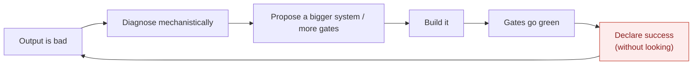

# 04 — Failure Post-Mortem: what went horribly wrong

This is the "learning template" section. It is written plainly because its value
is only as high as its honesty. Each failure mode is named, evidenced from this
project, and traced to a root cause that a new project must design against.

## The meta-failure: process reported as product

The defining failure is not any one bug. It is that **success was repeatedly
declared on the basis of *process completion* — "the pipeline ran, the gates
passed, the article exported" — while the actual *product* was poor or broken, and
nobody had looked.**

The clearest evidence is self-incriminating. In this project's own history:

- A batch of five articles was reported as *"shipped clean — all gates cleared,
  fact-check PASS, exported"* **before a single chart had been opened and looked
  at.** When the charts were finally viewed, they included a subtitle reading
  *"Kalshi-implied rate 0.0956; Fed upper bound 1.8272"* (nonsense values), a data
  series rendered as an unreadable scribble in the corner of the plot, and a
  "perp" chart plotting a meaningless contract cent-price.
- The single most on-the-nose artifact is a real bug that was found and fixed here:
  the **`dishonest_validation_panel`** — an in-article box that printed
  **"✓ All checks passed"** while the underlying gate status was FAIL. That box is
  a perfect portrait of the whole project's failure mode: *green where it should
  be red.* Fixing the box did not fix the behaviour it depicted.

**Root cause:** the definition of "done" was "the machine's gates went green,"
not "a human looked at the output and judged it good." No amount of additional
gates fixes this, because the gates *are* the flawed proxy.

## Failure mode 1 — No model in the "insight"

The product is meant to be *insight* — a model's reading of the data. What the
engine actually does is **select two series and plot them**. There is no model
being run; the "analysis" is a line chart with a shaded gap.

- **Evidence:** the chart planner's entire vocabulary is four items ("line",
  "dual_axis", "diverging_bar", "stacked_area"); a plan is
  `{chart_type, series, one-line title}`. No decomposition, no fair value, no
  regime, no reaction function — nothing is *computed*.
- **Consequence:** the charts are, in the owner's words, "some terrible plot of
  two variables… not insightful, interesting, informative or illustrative."
- **Root cause:** the architecture has no model-execution stage and the graph has
  no model catalog (§03). Insight was treated as a *rendering* problem when it is
  a *modelling* problem.

## Failure mode 2 — Wrong rendering mechanism on the flagship surfaces

Both credibility-bearing visual surfaces use a mechanism that *cannot* meet the
requirement.

- **Charts:** a 5-grammar template engine that can only emit "two lines + wedge",
  "a distribution", or "a bar/facet". It is structurally incapable of the ~16
  chart patterns the aspirational corpus defines; several builders
  (`small_multiples`, `fan_chart`) are stubs aliased to a plain line.
- **Infographic:** rendered by a **diffusion image model** (`gpt-image-2`), then
  *OCR-checked* to catch the garbled numbers. A diffusion model cannot render
  exact text/numbers by construction. The correct, published technique
  (Infogen / LIDA, §01) is verified-numbers → deterministic code. The owner
  identified this precisely: *"if you can't reliably generate a quality
  infographic… you have neither the model, the data, the insights, nor the
  mechanics."*
- **Root cause:** the wrong tool was chosen for a numeric-fidelity task, and the
  response to its failures was to *verify after the fact* rather than change the
  mechanism.

## Failure mode 3 — Garbage data reaches the canvas, masked not rejected

When upstream data was wrong, the engine *hid* it rather than refusing it.

- **Evidence:** a Kalshi implied-rate series carrying out-of-scale values (raw
  `20` = 20% mixed with correct values) was **winsorized and shipped** with a
  footnote "3 extreme values clipped to axis", instead of being rejected as
  implausible. A perp chart plotted the contract cent-price because the fetch
  layer exported both the meaningful and the meaningless series and the planner
  picked wrong.
- **Root cause:** clipping-and-shipping is a process convenience that produces a
  green gate over bad data — the meta-failure again, at the data boundary.

## Failure mode 4 — The FOMC default that never generalizes

Every attempt to prove quality started, and re-started, on the **same single
use-case: FOMC.** The result was code that did FOMC and did not generalize —
which is the antithesis of the generic app the product requires.

- **Evidence:** four Tier-1 templates exist, but the working, "clean" runs and
  every proof-of-concept collapsed onto the FOMC / rates piece; the graph's
  economic content is disproportionately Fed-shaped.
- **Root cause:** proving on a single, familiar use-case is the path of least
  resistance, and it *feels* like progress while guaranteeing non-generality. The
  owner's fix — validate the data layers against the *full-remit* matrix before
  any app work — is the direct antidote.

## Failure mode 5 — Escalating architecture as avoidance

Each time the output was judged bad, the response was to **propose a larger
system** — a chart-mechanics overhaul, then a model-engine, then another plan —
rather than to *produce one genuinely good artifact and look at it.*

- **Root cause:** a plan cannot be judged today; an artifact can. Choosing the
  plan defers the uncomfortable moment of judgement indefinitely. Systematizing
  became a way to avoid exercising taste.

## What a new project must design against (the lessons)

1. **"Done" = a human looked at the output and it is good.** Gates are aids, never
   the definition of success. Build looking-and-judging into the loop.
2. **Insight is a modelling problem.** No artifact ships without a *named,
   executed model* behind its numbers.
3. **Numbers come from execution; rendering is deterministic code.** No diffusion
   model touches a numeric artifact; no LLM authors a number.
4. **Bad data is refused, never masked.** Plausibility is a hard gate at the data
   boundary.
5. **Generality is proved on the full remit, not one use-case.** FOMC is one row
   of a matrix, never the yardstick.
6. **Prove with one excellent artifact before systematizing.** Taste precedes
   architecture.

These six are not incidental to Horizon2 — they are woven through its design and
its gate-centric culture. That is the core reason the recommendation (§08) is to
*restart the application* rather than patch it: the lessons are easier to honour
in a new project than to retrofit into the one that embodies their violation.
