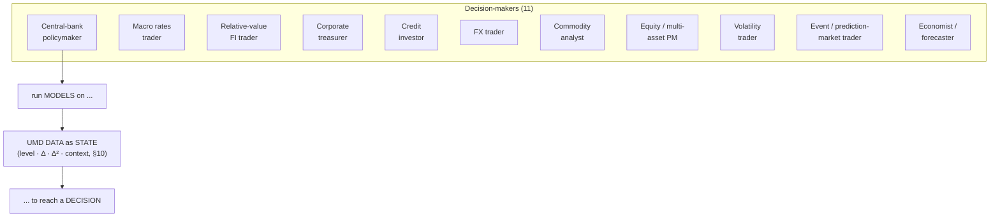

# 05 — Decision-maker × Model Matrix (the generic yardstick)

This matrix *is* the definition of "generic." It enumerates the decision-makers
the app must serve across the **full Lucidate remit**, the model(s) each runs, the
data those models consume, the outputs they produce, and the relationships the
graph must encode. The audit (§03) and gap analysis (§07) are scored against the
**union** of every row's requirements — so that "fit for purpose" means "fits
*all* of these," never "fits FOMC."

Each row also records whether the model already exists as a UMD `analysis/` /
`services/` implementation — the raw material for the model catalog.

## The personas

## The matrix

Legend for *"in UMD?"*: ✅ implemented · ◻ partial · ✗ missing.

> **Read every "data inputs" cell through §10.** Each listed input is consumed as
> a *state* — level, first derivative (direction/speed), second derivative
> (acceleration), and context (vs trend/percentile/regime/expectations) — and each
> model declares which orders it uses. The cells name the *variables*; the
> derivative/context stack applies to all of them, not only to inflation.

| # | Decision-maker | Decision | Model(s) | Key data inputs (multi-dimensional) | Output / insight | In UMD? |
|---|---|---|---|---|---|---|
| 1 | **Central-bank policymaker** | Set the policy rate | Taylor-rule variants, Fed reaction function, r-star, output-gap, Phillips curve, inflation-persistence | Core & headline CPI/PCE **and their Δ**, unemployment + gap, GDP/output gap, wages, breakevens, inflation expectations, financial-conditions index | Model-implied policy rate vs actual vs market; the persistence/gap read | ◻ (`rate_path_model`, `expectations`; reaction fn ✗) |
| 2 | **Macro rates trader** | Position duration / swap book ahead of events | Curve fair value, OIS-implied path, carry & roll-down, term premium (ACM), PCA (level/slope/curv), rate divergence | UST & OIS curves, SOFR/fed-funds futures, inflation, growth, CFTC positioning, rate vol | Fair value vs market gap; carry; positioning signal | ✅ (`curve_builder`, `rate_path_model`, `rate_divergence`, `fair_value`) |
| 3 | **Relative-value FI trader** | Spread / basis trades | Swap-spread fair value, butterfly/curve RV, cross-market basis, asset-swap | Government & swap curves, repo/funding, futures baskets | Rich/cheap signal per node/spread | ◻ (`derived_spreads`, `curve_builder`; RV models ✗) |
| 4 | **Corporate treasurer** | Hedge funding / FX / rates exposure | Cost-of-carry, hedge ratio, funding-vs-inflation, scenario | Rates, FX forwards, inflation, credit spreads, commodity input costs | Hedge recommendation; cost under scenarios | ✗ (inputs present; models ✗) |
| 5 | **Credit investor** | Credit allocation | Spread-vs-fundamentals, Merton/structural PD, spread decomposition (risk premium) | IG/HY & sovereign CDS spreads, ratings, leverage, equity vol, macro | Fair spread vs market; PD; premium decomposition | ◻ (`sovereign_cds` data; structural models ✗) |
| 6 | **FX trader** | Currency positioning | Rate/inflation-differential & carry, PPP/REER, balance-of-payments | Rate & inflation differentials, terms of trade, positioning, reserves | Carry-adjusted fair value vs spot | ◻ (`fx` series; models ✗) |
| 7 | **Commodity analyst** | Commodity positioning | Supply/demand balance, inventory/storage, cost-curve, seasonality, crack/spark spread | EIA/USDA/FAO balances, inventories, refinery/utilisation, FX, weather | Balance surplus/deficit; fair price band | ◻ (EIA/USDA/FAO data; balance models ✗) |
| 8 | **Equity / multi-asset PM** | Allocation / valuation | Equity risk premium, earnings-yield vs real rates (Fed model), factor/sector, DDM | Equity prices & fundamentals, real rates, breakevens, vol, earnings | ERP; rich/cheap vs bonds; factor tilt | ◻ (`spx_fair_value`, `equity_fundamentals`; ERP ✗) |
| 9 | **Volatility / derivatives trader** | Vol positioning | Implied-vs-realized, vol surface, skew, variance risk premium | Vol surfaces (Deribit, SR3, equity options), realized vol, spot | VRP; skew signal; surface dislocation | ✅ (`vol_surface`, `historical_vol`, `equity_options`) |
| 10 | **Event / prediction-market trader** | Event bets | Implied probability, calibration / bias-correction, fair value vs market | Kalshi distributions & orderbooks, the underlying macro, model fair value | Edge vs market; calibration receipt | ✅ (`kalshi_implied_distribution`, `pm_service`, `kalshi_bias_correction`) |
| 11 | **Economist / forecaster** | Forecast + surprise read | Nowcasting, surprise-vs-consensus, regime detection | Broad macro, market-implied & survey expectations, prior prints | Forecast; surprise vs expected; regime | ◻ (`surprise_detector`, `expectations`; nowcast ✗) |

## What the matrix demands of each data layer

Reading the union of the rows top-to-bottom yields the requirement spec:

- **Time-series (raw + derived):** every input column must exist as a
  consistently-classified series — exposed as the full §10 state stack (level,
  Δ, Δ², context) and including derived quantities (gaps, spreads, differentials,
  breakevens, real rates) — across
  rates, inflation, labour, growth, housing, credit, FX, commodities, equities,
  vol, and prediction markets. (Coverage confirmation and taxonomy fix: §07.)
- **Relational (config + runs):** each model needs a stored *specification*
  (params, input-map, assumptions, the decision it informs) and a *run* record
  with output points. (`fv_runs` is the seed; generalize it: §07.)
- **Graph (the spine):** `DecisionMaker → USES → Model → HAS_SPEC →
  ModelSpecification → TAKES_INPUT → ModelInput(→DataSeries) → PRODUCES_OUTPUT →
  ModelOutput; Model → INFORMS_DECISION → Decision`, layered on the existing
  `Indicator` / `TRANSMITS_TO` substrate. (Entirely absent today: §03.)

## Reading the matrix for the recommendation

- **~55% of the models already exist** in UMD `analysis/` (rows 2, 9, 10 fully;
  1, 3, 5, 7, 8, 11 partially). The vision is *far* closer to reach on the data
  side than the current app suggests — because the app never used them as models.
- **The missing models are additions to the data platform**, not app code: a
  reaction function, RV models, a treasurer toolkit, structural credit, FX carry,
  commodity balances, ERP, nowcasting. Each is a `analysis/` implementation + a
  catalog entry — the same shape as what exists.
- **The FOMC row is one of eleven.** Building the matrix first is precisely what
  prevents the FOMC-default failure (§04): the yardstick is the whole column, and
  the data layers are declared fit only when every row traces clean (§07, §09).
