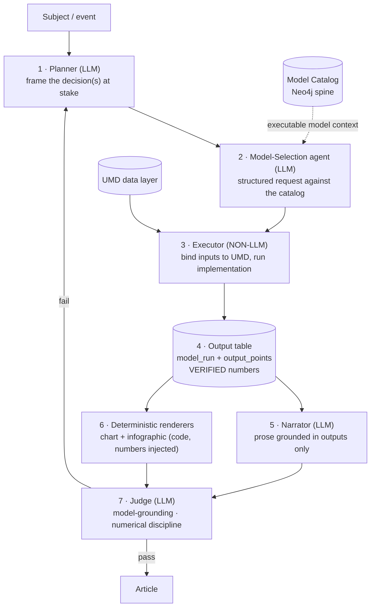
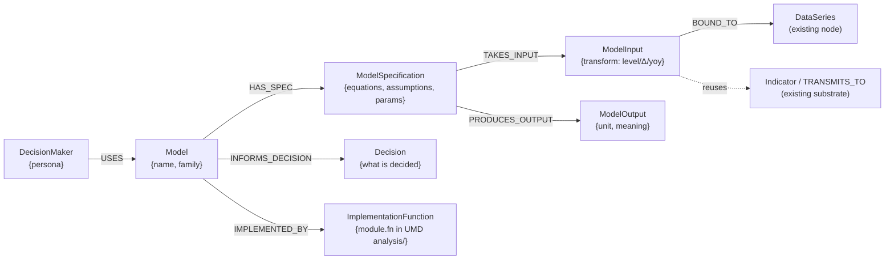
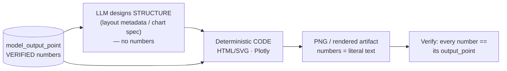

# 06 — Target Architecture

The target is the AI-Economist-Agent pattern (§01), specialised to Lucidate's
remit and consuming the salvaged UMD data layer. Its defining property: **the LLM
never authors a number.** Numbers come from executing catalogued models; rendering
is deterministic code; the LLM selects, designs, and narrates.

## The engine

Seven roles, mapped to the paper and to existing assets:

1. **Planner** — identifies the decision(s) and the decision-maker(s) (§05).
2. **Model-Selection agent** — emits a *structured request* naming
   `ModelSpecification` node(s) from the catalog; never invents a model.
3. **Executor (non-LLM)** — binds each `ModelInput` tuple `{series, order, window}`
   to the required §10 state (level, Δ, Δ², or context), runs the model's
   implementation function (reusing UMD `analysis/`), and writes an output table.
4. **Output table** — the single source of every number downstream; persisted as
   `model_run` + `model_output_point`.
5. **Narrator** — writes prose *grounded strictly in the output table*.
6. **Deterministic renderers** — chart and infographic produced by code with the
   verified numbers injected as literal text.
7. **Judge** — scores model-grounding and numerical discipline; failure routes to
   revision. (This *replaces* the current gate battery's role, but with the right
   definition of "done": grounded and correct, not merely "passed".)

## Data-layer target schemas

### Graph — the model spine (the piece absent today)

Seeded from YAML like templates (`scripts/load_*` pattern), **run and verified**
(node/edge counts checked; three decision-makers spot-traced by Cypher).

### Relational — model config + runs (generalize `fv_runs`)

- `model_config(model_id, spec_json, params_json, input_map_json, decision, version)`
- `model_run(run_id, model_id, run_ts, inputs_snapshot, status)`
- `model_output_point(run_id, name, value, unit, source_computation)`

Every rendered number and every prose figure references a `model_output_point` —
the audit trail the Judge checks.

### Time-series — canonical taxonomy

A controlled `asset_class` vocabulary (rates, inflation, labour, growth, housing,
credit, fx, commodities, energy, metals, equities, crypto, prediction_markets),
plus a one-off normalization migration that collapses the current duplicates and
fills the blanks (§03, §07). Enables the Executor to bind model inputs by domain.

## Deterministic rendering (both surfaces, one principle)

- **Charts** render a model's *output* (implied vs actual vs market; the drivers),
  not raw series. The chart-mechanics work (axis semantics, real builders,
  editorial helpers) becomes the rendering substrate *under* the model outputs —
  necessary but subordinate.
- **Infographic** is produced by the Infogen/LIDA mechanism: verified numbers +
  LLM-designed layout → deterministic HTML/SVG (or Plotly) → PNG. **No diffusion
  model.** This is the litmus test, met by construction.

## Why this architecture cannot repeat the failure

Each documented failure mode (§04) is designed out at the architectural level:

| Failure mode (§04) | Designed-out by |
|---|---|
| Process reported as product | The Judge scores *grounding & correctness*, and "done" requires a human-viewed artifact (§09) |
| No model in the insight | Model execution is a mandatory pipeline stage; nothing renders without an output table |
| Wrong rendering mechanism | Deterministic code for all numeric artifacts; no diffusion, no LLM-authored numbers |
| Garbage data masked | Plausibility is a hard gate at input binding; the Executor refuses, never clips |
| FOMC default | The catalog is seeded across the full-remit matrix (§05); selection is generic |
| Architecture as avoidance | The first deliverable is one *executed, rendered, looked-at* artifact, not a system |
