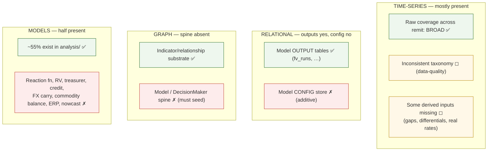

# 07 — Gap Analysis

This scores the three data layers against the **union of requirements** from the
decision-maker × model matrix (§05), using the live audit (§03). Each gap is
classified by *nature* — because the recommendation (§08) turns on whether the
gaps are additive (fixable in place) or architectural (rot).

## Gap map

## By layer

### Time-series (TimescaleDB) — *additive, low effort*

| Requirement (from §05 union) | Present? | Gap | Nature |
|---|---|---|---|
| Broad raw coverage across the full remit | ✅ 4,093 series | Confirm each matrix input has a series; a handful of derived inputs (output gap, real rates, differentials) to compute | Additive |
| A consistent `asset_class` taxonomy for routing | ✗ | `rates`/`interest-rates`/`yields`, blanks, dupes | Data-quality, one migration |
| Full input-state stack — level, Δ, Δ², context (§10) | ◻ | Δ/yoy exist ad hoc in code; no systematic, catalogued transform stack for *every* series | Additive |

**Verdict:** normalize the taxonomy (one migration) + compute a short list of
missing derived series. No storage re-architecture.

### Relational — *additive, low-medium effort*

| Requirement | Present? | Gap | Nature |
|---|---|---|---|
| Store model *outputs* / runs | ✅ `fv_runs`, `divergence_signals`, `regime_history`, snapshots | Generalize `fv_runs` to any model | Additive |
| Store model *config* (spec, params, input-map, decision) | ✗ | New `model_config` / `model_run` / `model_output_point` schema | Additive |

**Verdict:** a small, well-precedented schema addition. The pattern already exists.

### Graph (Neo4j) — *additive but foundational*

| Requirement | Present? | Gap | Nature |
|---|---|---|---|
| Indicator / transmission substrate | ✅ 603 `Indicator`, `TRANSMITS_TO`, … | Reused as-is | — |
| `DecisionMaker → Model → Spec → Input → Output → Decision` spine | ✗ (zero nodes) | Seed the entire catalog | Additive (new nodes/edges on existing substrate); foundational for the vision |

**Verdict:** the largest gap by importance, but still *additive* — it adds a
subgraph on top of a sound substrate; it does not require re-modelling the graph.

### Models (UMD `analysis/`) — *half present*

| Present (✅ / ◻) | Missing (✗) |
|---|---|
| Curve fair value, rate path, rate divergence, vol surface, historical vol, Kalshi implied distribution, bias-correction, density, spx fair value, derived spreads, expectations, surprise detector | Reaction function, RV models, treasurer toolkit, structural credit/PD, FX carry/PPP, commodity supply-demand balance, equity risk premium, nowcasting |

**Verdict:** the missing models are new `analysis/` implementations + catalog
entries — the same shape as the ~55% that already exist. This is data-platform
work, not app work.

## The critical read

Every gap above is **additive** — new series, a taxonomy migration, a config
schema, catalog nodes, more `analysis/` models. **None is architectural rot in the
data platform.** The data layers are *not fit today*, but they become fit through
bounded extension, not redesign. This is the empirical basis for **salvaging the
data platform** (§08).

The single gap that is *architectural* — the absence of a model-execution spine —
lives in the **application**, whose entire design presumes it away (§02, §04).
That is the empirical basis for **restarting the application** (§08).
