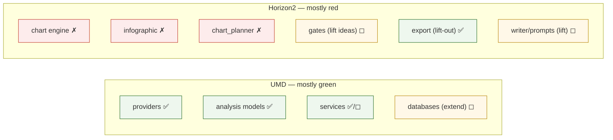
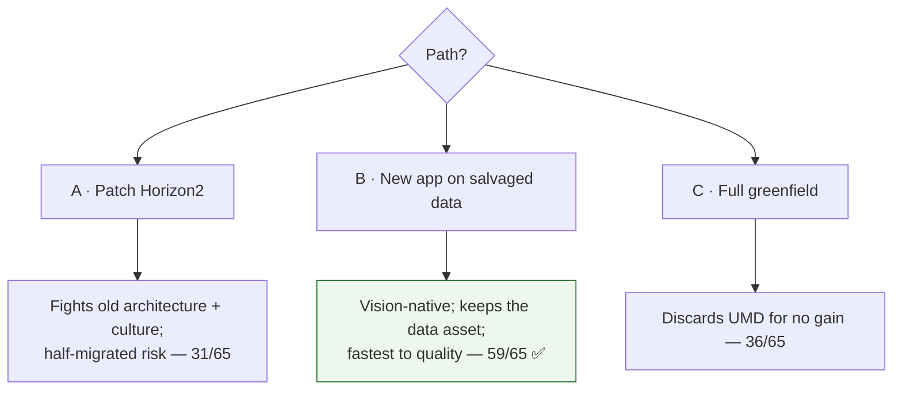

# 08 — Salvage vs Rewrite (the decision)

This is the document the assessment exists to produce. It reaches the
recommendation through a component inventory, three candidate paths, and a scored
comparison — not a hunch.

## Step 1 — Component inventory (reuse / refactor / discard)

Each component is classified against the target architecture (§06).

### Data platform — UMD (55,700 LOC)

| Component | LOC | Classification | Reason |
|---|---|---|---|
| 38 providers | 13.4k | **Reuse** | Sound `BaseProvider` pattern; the data ingestion is the asset |
| 25 analysis models | 11.6k | **Reuse** | The vision's "implementation functions" already exist here |
| 46 services | 18.2k | **Reuse / refactor** | `pm_service`, `expectations`, `surprise_detector` reused; orchestration lightly refactored |
| MarketDataAPI | 2.8k | **Reuse** | The clean seam the new app consumes |
| TimescaleDB + relational | — | **Reuse + extend** | Normalize taxonomy; add model-config store (§07) |
| Neo4j substrate | — | **Reuse + extend** | Keep indicator ontology; seed the model spine (§07) |

**UMD reuse rate: ~95%.** The additions are extensions, not replacements.

### Application — Horizon2 (32,300 LOC)

| Component | LOC | Classification | Reason |
|---|---|---|---|
| Chart engine (`build_charts`, 5-grammar) | 9.5k | **Discard** | Wrong mechanism; structurally caps insight; renders raw series |
| Infographic (`gpt-image-2` path) | ~1.5k | **Discard** | Diffusion model cannot render exact numbers |
| chart_planner | ~1k | **Discard** | Picks series+shape; no model reasoning |
| Quality gates | ~3k | **Refactor / lift ideas** | The "numbers must trace" discipline is worth keeping; the gate-*culture* is not |
| write_article + prompts | ~4.5k | **Lift selectively** | Prose craft & SoTA prompt patterns are reusable; the grounding target changes |
| Export (DOCX / Substack HTML) | ~2.7k | **Reuse (lift-out)** | Genuinely good, architecture-agnostic; portable to a new app |
| LangGraph orchestration | — | **Reuse the know-how** | The team's LangGraph competence transfers; the specific graph does not |

**Horizon2 reuse rate: ~20–25%**, and mostly as *lift-outs* (export, prompt
craft, discipline) rather than a running spine. The two flagship surfaces (charts,
infographic — ~11k LOC, ~35% of the app) are discards.

## Step 2 — Three candidate paths

- **Path A — Patch Horizon2 in place.** Bolt a model engine, cross-section
  charts, and a code-based infographic onto the existing pipeline.
- **Path B — New application project on the salvaged data layer.** Keep and extend
  UMD; build a new app repo whose architecture is the model→data→insight engine
  from day one; lift out the few good Horizon2 parts (export, prompts, discipline).
- **Path C — Full greenfield.** Rebuild everything, including UMD.

## Step 3 — Scored comparison

Scores 1 (poor) – 5 (excellent). Weight reflects owner priorities: fit to the
vision and data-asset preservation dominate.

| Criterion (weight) | A: Patch | B: New app / salvage data | C: Greenfield |
|---|---|---|---|
| Fit to model→data→insight vision (×3) | 2 | 5 | 5 |
| Escapes the embedded gate-culture (×2) | 1 | 5 | 5 |
| Preserves the data asset (×3) | 5 | 5 | 1 |
| Effort / time to first *quality* artifact (×2) | 2 | 4 | 1 |
| Risk (regression, half-migrated state) (×2) | 2 | 4 | 2 |
| Leverages team's existing know-how (×1) | 4 | 4 | 2 |
| **Weighted total (max 65)** | **31** | **59** | **36** |

**Path B wins decisively.** Path A is dragged down by fighting an architecture and
culture built around the vision's absence — a half-migrated pipeline is the worst
of both worlds. Path C throws away UMD, a 55.7k-LOC, three-database asset, for no
architectural benefit over B.

## Step 4 — The recommendation

> **Salvage the data platform (UMD) in full and extend it; do not patch Horizon2 —
> stand up a new application project on the salvaged data layer, built as the
> model→data→insight engine from the first commit, and lift out only Horizon2's
> few architecture-agnostic strengths (DOCX/Substack export, prompt craft, the
> numbers-must-trace discipline). Keep Horizon2 in the repo, read-only, as the
> documented "learning template of what went wrong."**

### Why not "just salvage" (Path A)

The temptation is to keep the working pipeline and add the missing pieces. But the
missing piece is the *spine* — model execution — and Horizon2's every node
presumes its absence. Retrofitting a spine into a body built without one is slower
and riskier than a new body, and it carries the gate-centric culture (§04) forward
intact. The `dishonest_validation_panel` is the warning: the culture is in the
code.

### Why not "rewrite everything" (Path C)

UMD is not the problem. It is 55.7k LOC of sound ingestion and real models, three
mature databases, and 4,093 series — the exact foundation the vision needs, and
the thing the owner rightly insisted we validate first. Rebuilding it would be the
most expensive possible way to make no architectural progress.

### The nuance that matters

This is not "the project failed, start over." It is **"the expensive, sound half
succeeded and is kept; the mis-architected half is restarted."** The data platform
is the asset; the application is the learning template. Naming them separately is
the single most important output of this assessment.

## What this decision unblocks

Nothing in the application is built until the **data-layer conviction test** (§09)
passes — the taxonomy is clean, the model-config store exists, the graph spine is
seeded, and every decision-maker in the matrix (§05) traces cleanly through the
three layers. Only then does the new application's first, single, *looked-at*
quality artifact get built.
