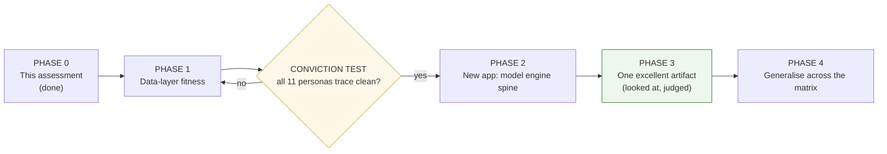

# 09 — Roadmap (recommended path)

Path B: **salvage + extend UMD; build a new application on top of it.** The
sequence is deliberately data-layer-first, with a hard gate — the *conviction
test* — before any application code. No use-case (least of all FOMC) is built
until the data layers serve *all* of them.

## Phase 1 — Data-layer fitness (no app code)

The only work until the gate. All in UMD.

1. **Author the model catalog** as YAML seeds covering the §05 matrix, using the
   **literature review (§11)** as the source content: for each persona, its
   model(s), spec (form/equations/assumptions/params), **input tuples**
   `{series, order, window}` per the §10 state stack, outputs, the model's
   `asserts`/`interpretation` text, and the decision informed. Where the model
   exists in `analysis/`, point `IMPLEMENTED_BY` at it; else record a build stub.
2. **Normalize the time-series taxonomy AND build the transform stack (§10):** a
   controlled `asset_class` vocabulary + a one-off migration collapsing duplicates
   and filling blanks (§07); plus a systematic, catalogued transform stack (level,
   Δ, Δ², context/z-score, diffusion, surprise) so any model input can be served
   at the derivative order it requires. Add the missing derived series (gaps, real
   rates, differentials).
3. **Add the relational model store:** `model_config` / `model_run` /
   `model_output_point` (generalize `fv_runs`).
4. **Seed the graph model spine** (§06) from the YAML — and **verify it loaded**
   (node/edge counts; spot-trace three personas by Cypher). *Seeds are run, not
   just written* — a lesson from this project.
5. **Build the missing high-priority models** in `analysis/` (reaction function
   first only because it is broadly reused, then RV, credit, FX carry, commodity
   balance, ERP, nowcast), each as an implementation function + catalog entry.

## GATE — the conviction test

For **every** decision-maker in the matrix, prove the trace end-to-end through the
three layers:

`Decision → Model (graph spec) → inputs present & correctly classified
(time-series) → implementation exists (analysis/) → outputs storable (relational)
→ relationships present (graph)`

A machine-checkable report lists, per persona, PASS or the exact missing link.
**The data layers are declared fit only when the report is N/N.** Application work
does not begin before this. This is the owner's gate, made concrete and testable.

## Phase 2 — New application: the engine spine

A new repository (e.g. `horizon3`) consuming UMD via the existing seam. Build the
seven-role engine (§06) using the **SoTA agentic patterns and context-engineering
of §12** — structured-output number-grounding, the evaluator-optimizer Judge, and
the Neo4j model spine doubling as the agents' structured long-term memory — as
thin, honest stages:

- Planner → Model-Selection agent (structured request against the catalog) →
  Executor (non-LLM, binds + runs, refuses implausible inputs) → output table →
  Narrator (grounded) → deterministic renderers → Judge.
- Lift out from Horizon2, deliberately: the DOCX/Substack export, the prompt
  craft, and the numbers-must-trace discipline. Nothing else is ported.

## Phase 3 — One excellent artifact (the real proof)

Produce, for **one** decision on **one** subject, the full chain: a selected model,
executed on UMD, a **model-grounded chart** and a **code-rendered infographic with
verified numbers**, and prose grounded in the output table. Then **open it and
judge it by eye** against the FT / Economist bar — with the owner. "Done" means it
looks good, not that a gate passed. Iterate on the artifact until it is genuinely
excellent. This is the litmus test, met properly.

## Phase 4 — Generalise across the matrix

Only after one artifact is proven excellent, extend selection/execution/rendering
across the other decision-makers, one persona at a time, each judged by eye. The
matrix (§05) is the coverage checklist; breadth is earned, not assumed.

## Guardrails carried from the post-mortem (§04)

- Every phase ends with a *looked-at* artifact or a *machine-checked* fact — never
  "the gate passed."
- No diffusion model touches a numeric artifact.
- No number is authored by an LLM.
- Bad data is refused at the boundary, never clipped-and-shipped.
- Generality is proven on the full remit; FOMC is one row.

## Indicative sequencing (not a commitment)

| Phase | Nature | Gate to exit |
|---|---|---|
| 1 — Data fitness | UMD extension only | Conviction test N/N |
| 2 — Engine spine | New app scaffold | One model executes end-to-end, numbers traced |
| 3 — One artifact | Depth | Owner judges it excellent by eye |
| 4 — Generalise | Breadth | Each persona's artifact judged excellent |
