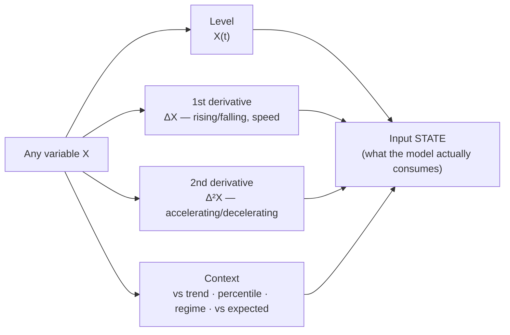

# 10 — Model Input Representation: level, derivatives, and context

This document corrects a naïveté in the earlier drafts. They repeated the phrase
*"inflation and its rate of change"* so often that they implied the derivative of
a variable matters *only for inflation*. That is wrong, and building on it would
invite disaster. **The derivative principle is universal.**

## The principle

A professional never feeds a model a raw number. They feed it a **state**: the
variable's level *and* its motion. For **every** input, the questions are:

1. **Level** — where is it? (housing starts at 1.35m)
2. **First derivative (velocity)** — is it rising or falling, and *how fast*?
   (starts down 4% m/m)
3. **Second derivative (acceleration)** — is the *change itself* speeding up or
   slowing? (the decline is decelerating — a possible turn)
4. **Context** — how does this compare to trend, history, regime, and to what was
   *expected*? (starts in the 20th percentile of a decade; below consensus)

Housing starts *falling* is a different world from housing starts *rising*;
rising-but-decelerating often signals an inflection a level-only reading misses
entirely. The same is true of payrolls, ISM new orders, credit spreads, the
curve, real yields, oil inventories, and every other input in the matrix (§05). A
level alone is frequently insufficient; the model's *meaning* lives in the motion.



## This is established practice, not a Horizon idea

The finance and macro literature *formalises* the derivative view:

- **Momentum oscillators are literally derivatives.** Technical oscillators are
  "second or third derivative functions" of a series; the McClellan Oscillator is
  the rate of change of the advance–decline line — acceleration of breadth.
  ([leading indicators](https://www.conference-board.org/topics/us-leading-indicators/))
- **Diffusion indices encode the first derivative across many series at once.**
  ISM prints above/below 50 measure whether the *breadth* of activity is
  expanding or contracting — a first-derivative reading, not a level. ISM **new
  orders** is watched precisely because it leads (the derivative leads the level).
- **Leading indicators are derivative constructs** that "change before the broader
  economy does (commonly 3–12 months ahead)"
  ([LEI](https://www.conference-board.org/topics/us-leading-indicators/)) — you
  read them for direction and acceleration, not level.
- **Whole models are built on momentum.** The Atlanta Fed **GDPNow** nowcast
  aggregates the *changes* in 13 subcomponents (ISM, construction, vehicle sales,
  trade, employment, IP, housing starts, PPI/CPI) into a running estimate — a
  model whose inputs are fundamentally rates of change
  ([GDPNow](https://www.atlantafed.org/research-and-data/data/gdpnow/explainer)).
- **Surprise indices** (actual vs *expected*) are the "context vs expectations"
  axis made into a series — the same object the expectations layer already in UMD
  produces.

## What this changes in the data-layer requirements

This is not a wording fix; it changes the specification of two layers.

### Time-series layer — a derivative/transform *stack* per series
It is not enough to store levels. For every series the model matrix consumes, the
layer must be able to produce, on demand and consistently:

| Transform | Meaning | Example construct |
|---|---|---|
| level | X(t) | raw |
| Δ (mom/qoq/yoy) | first derivative | rate of change |
| Δ² | second derivative | acceleration / momentum-of-momentum |
| rolling context | vs its own history | z-score, percentile, vs trend |
| breadth / diffusion | first derivative across a group | %-of-components-rising |
| surprise | vs expected | actual − consensus / market-implied |

Some of these exist ad hoc in UMD code (`yoy`, `mom`); **none is systematically
declared or stored as a first-class, catalogued transform.** That is the gap
(§07): a canonical transform stack, not scattered helpers.

### Graph layer — `ModelInput` must declare *which* derivative and window
A model input is not "a series." It is a **tuple**:

```
ModelInput = { series, order ∈ {level, Δ, Δ², context, diffusion, surprise},
               window, transform_params }
```

The catalog must record, per model, *which order and window of which series* the
model consumes — because the reaction function wants inflation's *level and its
change*, the momentum/nowcast models want *changes and acceleration*, and a
valuation model wants a *level in context*. Encoding only "series → model"
(as the dangling `USED_BY_MODEL` edge does today) is insufficient and would
reproduce exactly the naïve reading this document corrects.

## The corrected framing (to be applied throughout the set)

Wherever the earlier drafts said *"inflation and its rate of change,"* read the
general rule:

> **Every model input is a state — level, first derivative, second derivative,
> and context — and the model catalog must declare which of these each model
> consumes. Inflation is one example among all variables, not the exception.**

§05 (the matrix), §06 (target schema), and §07 (gap analysis) are to be read with
this correction; the `ModelInput` tuple above is the concrete requirement it
places on the graph and time-series layers.
