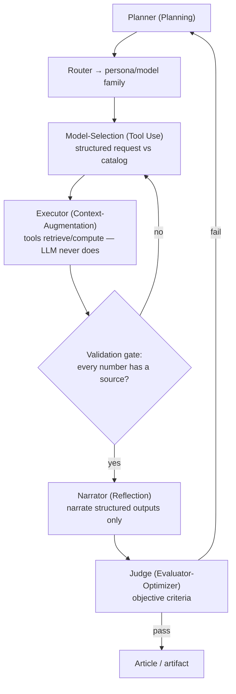
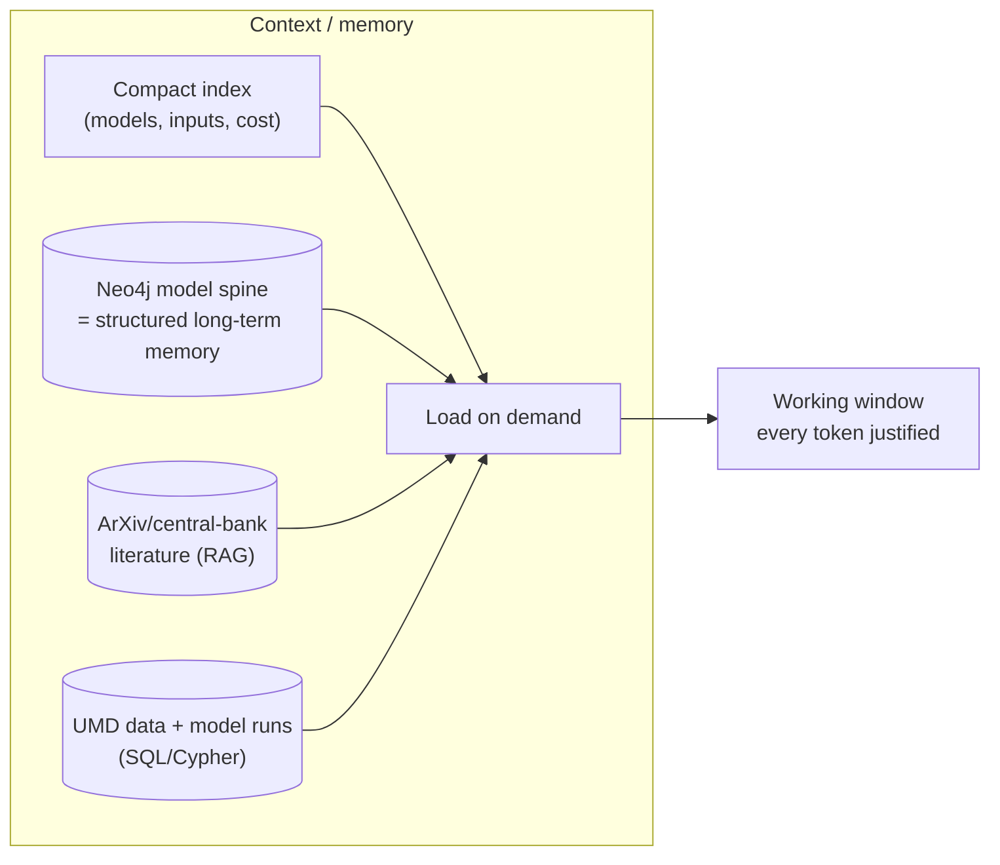

# 12 — SoTA Agentic Architecture, Prompting & Context Engineering

The earlier drafts asserted a seven-role pipeline (§06) without reviewing *how*,
in 2026 practice, such agents are actually built, prompted, and kept reliable.
This document supplies that review and maps it onto the model-grounded pipeline.
The governing constraint throughout: **the LLM selects, plans, and narrates; it
never authors a number.** Everything below is chosen to enforce that.

## 1. The agentic design patterns (and where each is used)

The 2026 literature has converged on a small vocabulary of patterns; production
systems combine them rather than picking one.

| Pattern | Mechanism | Where in our pipeline |
|---|---|---|
| **Planning** | Decompose the task before acting | Planner: frame the decision(s) and decision-maker(s) at stake |
| **Routing** | Classify intent → dispatch to a specialist | Route a subject to the relevant persona/model family; "misrouting → invalid narrative" |
| **Tool Use / Context-Augmentation** | LLM selects external tools/data; never computes internally | Model-Selection + Executor: numbers come from tools/DB, "never performs arithmetic internally" |
| **Prompt-Chaining** | Sequential subtasks passing **structured** data, with validation gates between | select → execute → validate → narrate; "insert validation gates so mistakes don't cascade" |
| **Parallelization** | Independent subtasks concurrently; voting/consensus | run several candidate models / independent checks; majority-vote on a number's provenance |
| **Orchestrator-Workers** | Central LLM decomposes and delegates; workers retrieve, never author | orchestrate which workers fetch which model outputs |
| **Reflection** | Self-critique and revise before returning | narrator reviews prose against the output table before emitting |
| **Evaluator-Optimizer** | A *separate* judge scores against explicit criteria; generator revises | the Judge (below) — "makes quality measurable rather than vibes-based" |

**Design philosophy (explicit in the sources):** *start simple; add agentic
structure only when a simpler solution falls short.* The pipeline should be the
minimum set of these patterns that enforces number-grounding — not a maximal
multi-agent sprawl.



## 2. Structured output — the mechanism that forbids invented numbers

Between every stage, data passes as a **schema**, not prose. The canonical
number-carrying object:

```json
{ "name": "reaction_function_implied_rate",
  "value": 3.9, "unit": "%",
  "source": "model_run:MR-2026-07-10-taylor99",
  "source_computation": "taylor1999(pi=4.17, dpi=+0.3, gap=-0.4, rstar=0.9)",
  "as_of": "2026-07-10" }
```

Because the narrator receives only these objects (and the model's `asserts` /
`interpretation` text from §11), it can *explain* the number but has nothing to
invent from. This is the Infogen/LIDA principle (§01) at the data-flow level:
"pass only retrieved/computed fields to the narrative LLM, not raw documents —
this constrains the LLM to narrating selections, not generating numbers."

## 3. The Judge (Evaluator-Optimizer) — measurable quality, not vibes

A *separate* agent scores each artifact against explicit, objective criteria
(adapted from the AI-Economist-Agent judge, §01):

- **Model grounding** — every quantitative claim traces to a `model_run` /
  `model_output_point`. Naming a model without an executed run scores zero.
- **Numerical discipline** — no number appears without provenance metadata; the
  narrative never contradicts the output table.
- **Interpretation vs computation** — the prose distinguishes the model's
  *interpretation* (qualitative) from its *computed* figures (quantitative).
- **Derivative correctness (§10)** — where a model consumes a rate of change or
  acceleration, the prose reflects direction and speed, not just level.
- **Audit** — the artifact exposes enough to trace every claim to its source.

Failure routes to revision (Reflection). "Poorly designed stopping criteria trap
systems in suboptimal states" — so the gate is *source-verification passing*, not
a turn count, and — per §04 — the ultimate acceptance is a **human looking at the
artifact**, with the Judge as an aid, never the definition of done.

## 4. Context engineering — the discipline that makes it reliable

"Most agent failures aren't model failures; they're **context failures**." The
2026 practice:

- **Memory tiers.** *Working* (the live window), *short-term* (this run's tool
  results), *long-term* (cross-run: editorial preferences, prior calibration,
  model provenance) — with a **compaction** step that condenses old turns into
  summaries.
- **Index-then-load, not dump.** Naïve RAG loads ~35k tokens of which "only ~6%
  is relevant — the rest pollutes the window and degrades performance." Instead,
  show the agent a **compact index** (model names, inputs, token cost) and let it
  **load on demand**. Every token in the window must have a reason to be there.
- **Retrieval modes matched to the store:** classical RAG for the *literature*
  (ArXiv model curation), **structured queries** for the *catalog and data*
  (Cypher against Neo4j, SQL against the model store), file reads, and
  **just-in-time** retrieval by identifier.
- **Knowledge-graph memory — a direct fit.** State-of-the-art memory systems
  (A-MEM's Zettelkasten of linked notes; **Zep/Graphiti's temporal knowledge
  graph** where nodes are entities and edges carry timestamps) are *exactly the
  shape of the model spine we must build anyway* (§06). Lucidate already runs
  Neo4j — the model catalog **is** the agent's long-term structured memory. This
  is a strategic alignment: the graph that stores the models is also the retrieval
  substrate that keeps the agents grounded.
- **"Bad retrieval is one of the largest sources of hallucinated answers"** — so
  retrieval quality (the right model spec, the right series, the right derivative
  order) is a first-class reliability concern, not plumbing.



## 5. Prompting discipline (model-grounded narration)

The narrator's system prompt, following the AI-Economist-Agent's proven
conditioning:

- Supply: the selected `ModelSpecification` (form, `asserts`, `interpretation`),
  the `model_run` id, and the `model_output_point` table.
- Instruct: *"Link every quantitative claim to a model output. Distinguish the
  model's economic interpretation from its computed numbers. Do not state that a
  model was run unless a run id is provided. Where a model consumes a rate of
  change or acceleration, describe direction and speed, not level alone."*
- Forbid: authoring any figure; recomputing arithmetic; describing a chart feature
  not present.

Their controlled result is the target: moving the output *"from a fluent
narrative to a traceable economic analysis."* That single sentence is the
difference between Horizon2's prose and the product.

## 6. What this review adds to the recommendation

- The target architecture (§06) is not hand-waving: it is the mainstream 2026
  agentic pattern set (Planning + Routing + Tool-Use + Prompt-Chaining +
  Evaluator-Optimizer + Reflection) specialised to number-grounding.
- **Context engineering is where reliability is won or lost**, and Lucidate's
  existing Neo4j is a genuine head-start — the model spine doubles as the agents'
  structured long-term memory.
- None of this can be prompted into existence until the **model catalog (§11) and
  the derivative-aware inputs (§10) exist in the data layers.** This is the final
  confirmation of the sequencing (§09): *data layers first, agents second* — the
  agents are only as grounded as the catalog and data they retrieve from.

**Sources:** [Agentic design patterns 2026 (SitePoint)](https://www.sitepoint.com/the-definitive-guide-to-agentic-design-patterns-in-2026/) ·
[HF: design patterns for agentic workflows](https://huggingface.co/blog/dcarpintero/design-patterns-for-building-agentic-workflows) ·
[Context engineering (Sourcegraph)](https://sourcegraph.com/blog/context-engineering) ·
[Context engineering & memory (Weaviate)](https://weaviate.io/blog/context-engineering) ·
[AI Economist Agent, arXiv 2606.20041](https://arxiv.org/abs/2606.20041) ·
[Infogen, arXiv 2507.20046](https://arxiv.org/html/2507.20046v1)
