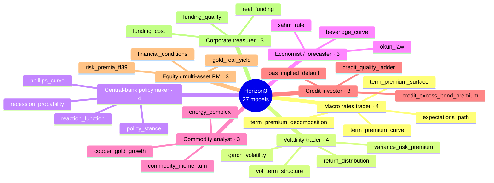
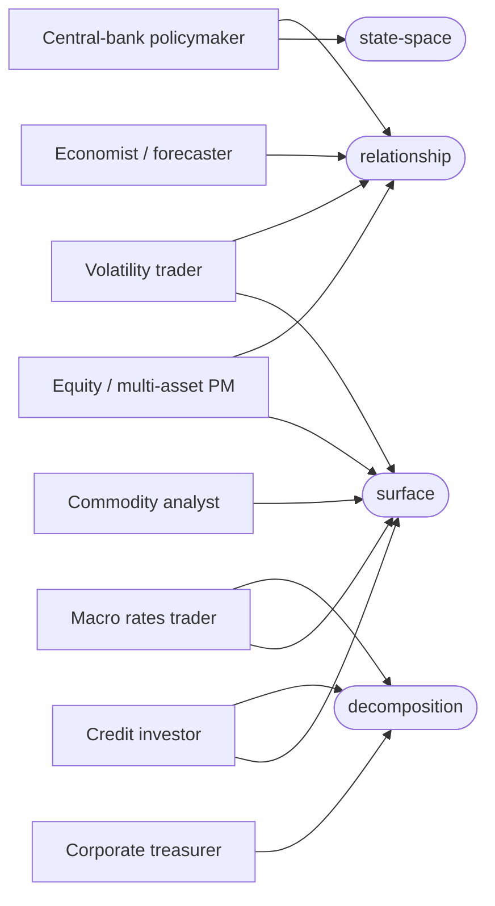

# Horizon3 infrastructure review — the model estate

_27 models across 8 personas · 85 inputs · 111 authored charts · 43 interpretive rules._

Auto-generated from `catalog/graph/*.yaml`. "Insights" = a model's authored `interpretations` (when→says rules); every chart additionally carries its own one-line `insight`.

## 1 · Per persona

| Persona | Models | Inputs | Charts | Insights (rules) |
|---|--:|--:|--:|--:|
| Macro rates trader | 4 | 15 | 17 | 4 |
| Volatility trader | 4 | 12 | 16 | 6 |
| Central-bank policymaker | 4 | 12 | 16 | 6 |
| Economist / forecaster | 3 | 6 | 12 | 6 |
| Commodity analyst | 3 | 13 | 12 | 6 |
| Credit investor | 3 | 9 | 13 | 4 |
| Equity / multi-asset PM | 3 | 10 | 12 | 5 |
| Corporate treasurer | 3 | 8 | 13 | 6 |
| **Total** | **27** | **85** | **111** | **43** |

## 2 · Persona → models

## 3 · Structure-family coverage (persona → rich chart forms)

Which of the four chart-structure families each persona's models render as a rich, non-line form.
`state-space` is the §10 macro-regime quadrant — a cross-model dashboard, drawn here off the
central-bank / macro view rather than any single model.

## 4 · Per model

| Model | Persona | Inputs | Charts | Insights | Outputs | Rich families |
|---|---|--:|--:|--:|--:|---|
| `reaction_function` | Central-bank policymaker | 5 | 4 | 1 | 3 | — |
| `policy_stance` | Central-bank policymaker | 4 | 4 | 2 | 4 | — |
| `phillips_curve` | Central-bank policymaker | 2 | 4 | 2 | 3 | relationship |
| `recession_probability` | Central-bank policymaker | 1 | 4 | 1 | 2 | — |
| `energy_complex` | Commodity analyst | 5 | 4 | 2 | 3 | — |
| `commodity_momentum` | Commodity analyst | 4 | 4 | 2 | 6 | surface |
| `copper_gold_growth` | Commodity analyst | 4 | 4 | 2 | 1 | — |
| `funding_quality` | Corporate treasurer | 3 | 4 | 2 | 3 | — |
| `real_funding` | Corporate treasurer | 3 | 4 | 2 | 1 | decomposition |
| `funding_cost` | Corporate treasurer | 2 | 5 | 2 | 3 | decomposition |
| `credit_excess_bond_premium` | Credit investor | 3 | 5 | 2 | 4 | decomposition |
| `credit_quality_ladder` | Credit investor | 3 | 4 | 1 | 4 | surface |
| `oas_implied_default` | Credit investor | 3 | 4 | 1 | 3 | — |
| `beveridge_curve` | Economist / forecaster | 2 | 4 | 2 | 4 | relationship |
| `okun_law` | Economist / forecaster | 2 | 4 | 2 | 2 | relationship |
| `sahm_rule` | Economist / forecaster | 2 | 4 | 2 | 4 | — |
| `financial_conditions` | Equity / multi-asset PM | 4 | 4 | 1 | 4 | surface |
| `gold_real_yield` | Equity / multi-asset PM | 3 | 4 | 2 | 5 | relationship |
| `risk_premia_ff89` | Equity / multi-asset PM | 3 | 4 | 2 | 3 | — |
| `term_premium_surface` | Macro rates trader | 6 | 4 | 1 | 6 | surface |
| `expectations_path` | Macro rates trader | 3 | 4 | 1 | 1 | surface |
| `term_premium_curve` | Macro rates trader | 3 | 4 | 1 | 1 | surface |
| `term_premium_decomposition` | Macro rates trader | 3 | 5 | 1 | 5 | decomposition |
| `vol_term_structure` | Volatility trader | 4 | 4 | 1 | 5 | surface |
| `garch_volatility` | Volatility trader | 3 | 4 | 2 | 5 | — |
| `variance_risk_premium` | Volatility trader | 3 | 4 | 1 | 3 | relationship |
| `return_distribution` | Volatility trader | 2 | 4 | 2 | 4 | relationship |
