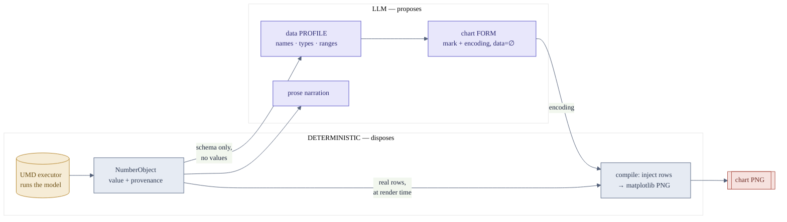
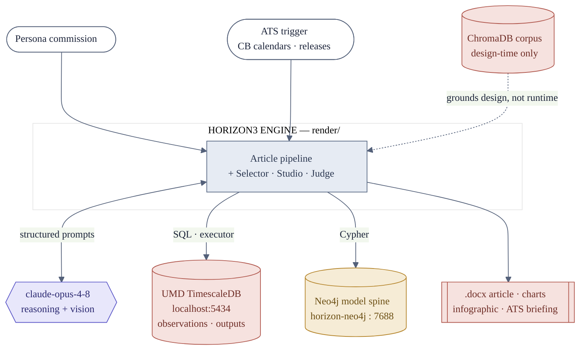
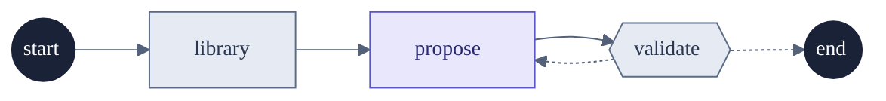
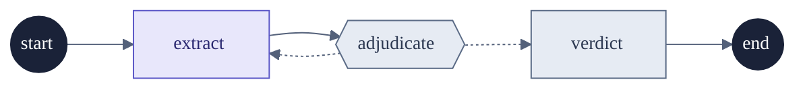
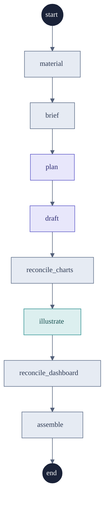
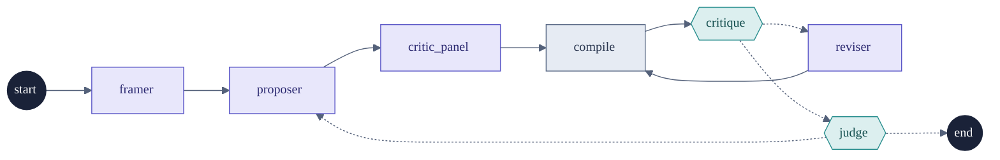

> **Version** `0.0.1` · commit `b8b25ed` (feat/sysdoc-living-docs) · generated 2026-07-21T09:17:31+00:00

# An engine where the LLM never authors a number

*Internal design document · model → data → insight → decision*

Horizon3 turns a decision-maker's *model*, run on real market data, into an article,
its charts, and its infographic — three renderings of one executed result. The
intelligence is agentic; the numbers are not. This document maps the LangGraph graphs,
the GraphRAG model spine that feeds them, and the prompts that steer them.

*The diagrams, tables, and counts below are generated from live code and the Neo4j
spine by `render/sysdoc/`; the prose is hand-owned.*

## The number firewall

Every design decision in this repo defends a single rule from `CLAUDE.md`: **the LLM
never authors a number.** Numbers are produced by *executing* a catalogued model on UMD
data; the LLM only **selects** which model to run, **designs** how to show it, and
**narrates** what it means. A companion rule keeps rendering deterministic — no
diffusion model touches a numeric artifact.

The firewall is enforced structurally, not by asking nicely. The Chart Studio agents
are shown a *data profile* — field names, types, ranges — and never the values. They
emit an encoding that references field names with its `data` array **forced empty**; the
compiler injects the real rows at render time.



## System context

Two triggers start work: a **persona** commissioned directly, or the **ATS**
(article-trigger system) surfacing a candidate from central-bank calendars, data
releases and standing pieces. The engine reaches one LLM (`claude-opus-4-8`, used for
both reasoning and vision) and two data systems inside the external UMD platform:
**TimescaleDB/Postgres** for the time series and executed outputs, and the **Neo4j
model spine** for the proven-model vocabulary. The ChromaDB corpus is a dashed,
design-time input — see the honesty note under the spine.



## The graphs

The subsystem is a set of LangGraph graphs that share one house pattern: a `state.py`
TypedDict, `nodes.py` of pure `State → partial-State` functions, and a `graph.py` that
wires the `StateGraph` — every step traced to LangSmith. The article pipeline is the
orchestrator; it invokes the selector, studio and judge as sub-graphs. The ATS is a
separate, hand-coded commissioning orchestrator (not a StateGraph) that decides *what*
to write before the pipeline decides *how*.

The roster below is generated from the compiled graphs. The small DAGs (selector,
judge, ATS) follow; the orchestrator and the studio get their own sections.

### The graph roster

| Graph | Package | Role | Nodes | Flow | LangSmith |
| --- | --- | --- | --- | --- | --- |
| article_graph | render/article_graph | Orchestrator — assemble the whole artifact | 8 | material → brief → plan → draft → reconcile_charts → illustrate → reconcile_dashboard → assemble | horizon3-article |
| selector | render/selector | Role 2 — which models to run | 3 | library → propose → validate | — |
| studio | render/studio | How to visualize an insight | 7 | framer → proposer → critic_panel → compile → critique → reviser → judge | horizon3-chart-studio |
| judge | render/judge | Role 7 — is the prose true? | 3 | extract → adjudicate → verdict | — |
| ats | render/ats | Commissioning (not a StateGraph) | 6 | harvest → map → readiness → score → shortlist → briefing | — |

*Model-Selection graph — Role 2 — which models to run*



*Grounding Judge graph — Role 7 — is the prose true?*



*ATS commissioning orchestrator (not a StateGraph)*

```mermaid
%%{init:{'theme':'base','themeVariables':{'fontFamily':'Helvetica,Arial,sans-serif','fontSize':'14px','primaryColor':'#eef2f7','primaryBorderColor':'#1A2238','primaryTextColor':'#1A2238','lineColor':'#54617a'}}}%%
flowchart LR
  __start__((start)):::term
  harvest["harvest"]:::det
  map["map"]:::llm
  readiness{{"readiness"}}:::det
  score["score"]:::llm
  shortlist["shortlist"]:::det
  briefing["briefing"]:::det
  __end__((end)):::term
  __start__ --> harvest
  harvest --> map
  map --> readiness
  readiness --> score
  score --> shortlist
  shortlist --> briefing
  briefing --> __end__
  classDef llm fill:#e8e7fb,stroke:#5b57c7,color:#2a2870;
  classDef vis fill:#dcefef,stroke:#2a8f8f,color:#124d4d;
  classDef det fill:#e6ebf3,stroke:#5b6b86,color:#2b3750;
  classDef term fill:#1A2238,stroke:#1A2238,color:#ffffff;
```



## The pipeline, end to end

The article graph threads a single `ArticleState` object through its nodes. Its design
intent, quoted in the source: charts, prose, and the dashboard are *projections of ONE
state rather than three artifacts built from three unsynchronised sources*. The `draft`
node is an atomic best-of-N loop — write, ground, critique, keep-best — and the two
`reconcile_*` nodes are the consistency stage the predecessor never had: they build the
charts the prose actually names and derive the dashboard from the finished article.

The DAG below is extracted from the compiled `article_graph`; node colour is its kind
(LLM / vision / deterministic) and hexagons mark gates.

*Article pipeline — extracted from the compiled graph*



## Chart Studio: choosing form as a reasoning problem

The Studio's premise, from its `__init__`: *"chart choice is a reasoning problem, not a
lookup table."* The insight — *what* to show — is authored upstream; the Studio chooses
the **form**: mark, encoding, and the editorial layer (reference lines, regime shading,
direct labels) that separates craft from "a muppet with the FT". Its DAG has two bounded
loops and — critically — a **vision** pass that looks at the rendered pixels.

The state machine and capability matrix below are extracted from the compiled `studio`
graph and a static read of its nodes.

*Chart Studio state machine — extracted from the compiled graph*



### Chart Studio — node capability matrix

| Node | Kind | Gate | Schema | Model | Temp |
| --- | --- | --- | --- | --- | --- |
| framer | LLM | — | Frame | claude-opus-4-8 | 0.2 |
| proposer | LLM | — | ChartEncoding | claude-opus-4-8 | 0.5 |
| critic_panel | LLM | — | PanelVerdict | claude-opus-4-8 | 0.2 |
| compile | DET | — | — | — | — |
| critique | VISION | yes | VisualCritique | claude-opus-4-8 | 0.1 |
| reviser | LLM | — | ChartEncoding | claude-opus-4-8 | 0.2 |
| judge | VISION | yes | Judgment | claude-opus-4-8 | 0.1 |

## The GraphRAG model spine

The live GraphRAG in this system is the **Neo4j model spine**. A `Model` node carries
`executable:true` *only after it actually ran*, alongside the run's `points` and
`as_of`. The selector's retrieval returns that closed set, and the LLM chooses among it.
It *cannot* pick a model that does not exist or cannot run, because it is never offered
one. The retrieval query:

```
MATCH (m:Model {catalog:'horizon3', executable:true})
OPTIONAL MATCH (m)-[:PRODUCES]->(o:Output)
OPTIONAL MATCH (m)-[:RENDERS]->(v:Visualization)
RETURN m.id, m.name, m.family, m.points, m.as_of, collect(o.name), collect(v.insight)
```

> **Honesty note — read before citing "RAG":** the Neo4j spine is the only retrieval
> that feeds an agent at runtime. The **ChromaDB corpus under `knowledge/` is
> design-time grounding only** — it is queried by humans, not imported by any node in
> `render/`. A runtime literature-RAG is a planned future step, not a shipped feature.

The census below is read live from `bolt://localhost:7688`. If the spine is offline when
this doc is built, the counts are omitted and this section says so — the doc still
renders.

**32** executable-catalog models · **50** proven model×jurisdiction cells · labels: `DataSeries`, `Decision`, `DecisionMaker`, `Jurisdiction`, `Model`, `Output`, `Role`, `Visualization` · relationships: `EXECUTABLE_IN`, `INFORMS`, `NEEDS`, `NEEDS_SERIES`, `PRODUCES`, `RENDERS`, `USES`

### Executable models by family

| Model family | Executable models |
| --- | --- |
| macro | 8 |
| rates | 7 |
| credit | 6 |
| vol | 4 |
| commodity | 3 |
| cross_asset | 3 |
| equity | 1 |

### Executable coverage by jurisdiction

| Jurisdiction | Currency | Executable models |
| --- | --- | --- |
| US | USD | 32 |
| EU | EUR | 6 |
| GB | GBP | 6 |
| JP | JPY | 6 |
| AU | AUD | 0 |
| CA | CAD | 0 |
| CH | CHF | 0 |

### Data gaps (roles missing in a jurisdiction)

| Jurisdiction | Missing role | Models blocked |
| --- | --- | --- |
| AU | headline_cpi | real_yield_term, phillips_curve, monetary_stance_lite, economies_scorecard |
| AU | leading_indicator | economies_scorecard |
| AU | long_yield_10y | recession_signal, real_yield_term, economies_scorecard |
| AU | unemployment_rate | sahm_rule, phillips_curve, economies_scorecard |
| CA | headline_cpi | real_yield_term, phillips_curve, monetary_stance_lite, economies_scorecard |
| CA | leading_indicator | economies_scorecard |
| CA | long_yield_10y | recession_signal, real_yield_term, economies_scorecard |
| CA | unemployment_rate | sahm_rule, phillips_curve, economies_scorecard |
| CH | headline_cpi | real_yield_term, phillips_curve, monetary_stance_lite, economies_scorecard |
| CH | leading_indicator | economies_scorecard |
| CH | long_yield_10y | recession_signal, real_yield_term, economies_scorecard |
| CH | unemployment_rate | sahm_rule, phillips_curve, economies_scorecard |

## How the agents are instructed

Prompts here are inline string literals inside each `nodes.py`, paired with a Pydantic
model via LangChain's `.with_structured_output(Model)`. There are no classic
function-calling tools — **the structured-output schema *is* the tool surface**, and
each schema's `Field(description=…)` text is itself part of the prompt.

The catalogue below is extracted statically: for each LLM/vision node, its
structured-output schema, the resolved model, and the **declared** temperature.
Note: `get_llm()` ignores temperature at runtime (Opus 4.8), so the value is shown for
call-site clarity, not runtime behaviour. The schema field tables that follow are pulled
from wherever each Pydantic class is actually defined.

**The principles the prompts encode:** LLM proposes / deterministic code disposes ·
start from the message, not a chart you like · never author a number (enforced in code) ·
look at the rendered pixels · constrain to a closed, proven vocabulary · feed rejection
reasons back as input rather than re-asking.

### Prompt catalogue

| Graph | Node | Kind | Schema | Model | Temp |
| --- | --- | --- | --- | --- | --- |
| article_graph | plan | LLM | — | — | — |
| article_graph | draft | LLM | — | — | — |
| article_graph | illustrate | VISION | — | — | — |
| selector | propose | LLM | Picks | claude-opus-4-8 | — |
| studio | framer | LLM | Frame | claude-opus-4-8 | 0.2 |
| studio | proposer | LLM | ChartEncoding | claude-opus-4-8 | 0.5 |
| studio | critic_panel | LLM | PanelVerdict | claude-opus-4-8 | 0.2 |
| studio | critique | VISION | VisualCritique | claude-opus-4-8 | 0.1 |
| studio | reviser | LLM | ChartEncoding | claude-opus-4-8 | 0.2 |
| studio | judge | VISION | Judgment | claude-opus-4-8 | 0.1 |
| judge | extract | LLM | Claims | claude-opus-4-8 | 0 |

### Structured-output schemas (the tool surface)

**`ChartEncoding`** — `render/studio/encoding.py`

| Field | Description |
| --- | --- |
| title | — |
| subtitle | — |
| message | The single communicative job, one sentence (compare/trend/spread/relationship/rank/part-to-whole). |
| mark | — |
| encoding | — |
| color_job | — |
| annotations | — |
| source_note | Provenance line, e.g. model + papers + as-of date. |
| rationale | Why this form/encoding carries the insight better than the alternatives. |
| data | Long-form rows; every value from an executed model output — the LLM never authors a number. |

**`Claims`** — `render/judge/claims.py`

| Field | Description |
| --- | --- |
| claims | — |

**`Frame`** — `render/studio/nodes.py`

| Field | Description |
| --- | --- |
| message | The ONE thing the chart must say, one sentence, naming the communicative job (compare/trend/spread/relationship/part-to-whole/rank/divergence). |
| candidate_marks | 2–3 chart FORMS worth proposing for this message+data-shape, from: line, area, bar, grouped_bar, dumbbell, slope, point, connected_scatter, bubble, heatmap, ridgeline, waterfall. Ordered best-first. Avoid defaulting to line/bar unless the data genuinely calls for it. |
| reasoning | Why these forms fit the message and the number/shape of variables. |

**`Judgment`** — `render/studio/nodes.py`

| Field | Description |
| --- | --- |
| verdict | True = ships (expressive, effective, carries the insight, and is differentiated — not something a muppet with the FT could reproduce). |
| notes | One or two sentences justifying the verdict against those criteria. |

**`PanelVerdict`** — `render/studio/nodes.py`

| Field | Description |
| --- | --- |
| chosen_index | 0-based index of the winning candidate. |
| rationale | Consensus of the three experts: why this encoding carries the insight best (effectiveness + insight-carriage + differentiation vs a vanilla default). |

**`Picks`** — `render/selector/state.py`

| Field | Description |
| --- | --- |
| picks | — |

**`VisualCritique`** — `render/studio/nodes.py`

| Field | Description |
| --- | --- |
| ok | True if the rendered chart is clean and reads clearly with no defects worth fixing. If omitted, inferred from whether defects were listed. |
| defects | Concrete rendered-pixel problems: label collisions, occlusion, clipped/overshooting axes, unreadable spaghetti, a legend that duplicates direct labels, a near-empty panel, etc. |
| fixes | Specific, encoding-level changes to fix each defect (e.g. 'set y scale.domain to [-1,6]', 'drop the legend, keep direct labels', 'switch color_job to diverging'). |

## Where the system refuses to ship

Agentic systems are defined as much by their gates as their generators. A gate here is a
node that is the source of a conditional edge — it routes forward only when its criterion
is met, and loops back otherwise. The table is derived from the compiled graphs'
conditional edges.

### Quality gates

| Graph | Gate node | Kind | Routes to (conditional) |
| --- | --- | --- | --- |
| selector | validate | DET | END, propose |
| studio | critique | VISION | judge, reviser |
| studio | judge | VISION | END, proposer |
| judge | adjudicate | DET | extract, verdict |

## Where this design is grounded

This document is generated by `render/sysdoc/` — a living-documentation generator that
extracts the volatile machine-truth (LangGraph DAGs via `get_graph().draw_mermaid()`,
the Neo4j spine census, an AST read of the prompts) into a versioned manifest, then
renders it into this stable narrative shell. A drift-gate
(`scripts/check_sysdoc_drift.py`) keeps the doc from silently diverging from the code
between commits; `--changelog` reports what changed between two versions.

The documentation form follows the state of the art for agentic + GraphRAG systems:
C4-for-agentic-AI (draw the LLM explicitly; model gates as first-class nodes; render
prompts as tables; colour node kinds), the three-card framing, the GraphRAG three-stage
pipeline shape, docs-as-code / living documentation, and prompt-documentation practice.

*Horizon3 · Lucidate Ltd · internal design document · generated from `render/`.
"Done" means a human looked at the output and it is good.*
