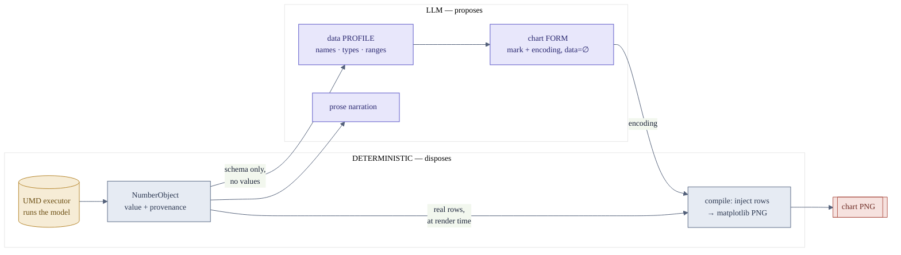

## The number firewall

Every design decision in this repo defends a single rule from `CLAUDE.md`: **the LLM
never authors a number.** Numbers are produced by *executing* a catalogued model on UMD
data; the LLM only **selects** which model to run, **designs** how to show it, and
**narrates** what it means. A companion rule keeps rendering deterministic — no
diffusion model touches a numeric artifact.

The firewall is enforced structurally, not by asking nicely. The Chart Studio agents
are shown a *data profile* — field names, types, ranges — and never the values. They
emit an encoding that references field names with its `data` array **forced empty**; the
compiler injects the real rows at render time.

