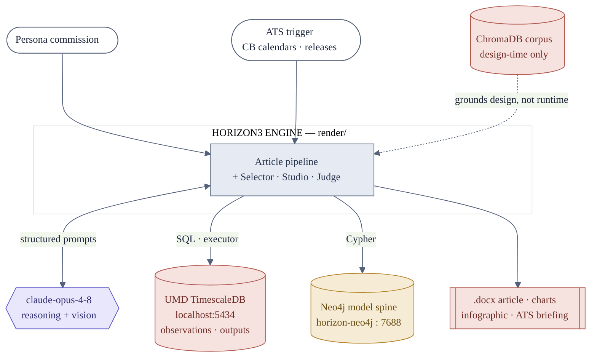

## System context

Two triggers start work: a **persona** commissioned directly, or the **ATS**
(article-trigger system) surfacing a candidate from central-bank calendars, data
releases and standing pieces. The engine reaches one LLM (`claude-opus-4-8`, used for
both reasoning and vision) and two data systems inside the external UMD platform:
**TimescaleDB/Postgres** for the time series and executed outputs, and the **Neo4j
model spine** for the proven-model vocabulary. The ChromaDB corpus is a dashed,
design-time input — see the honesty note under the spine.

